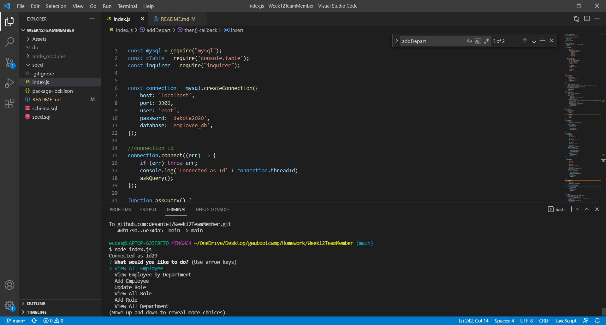
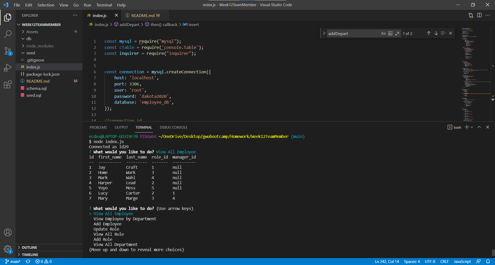
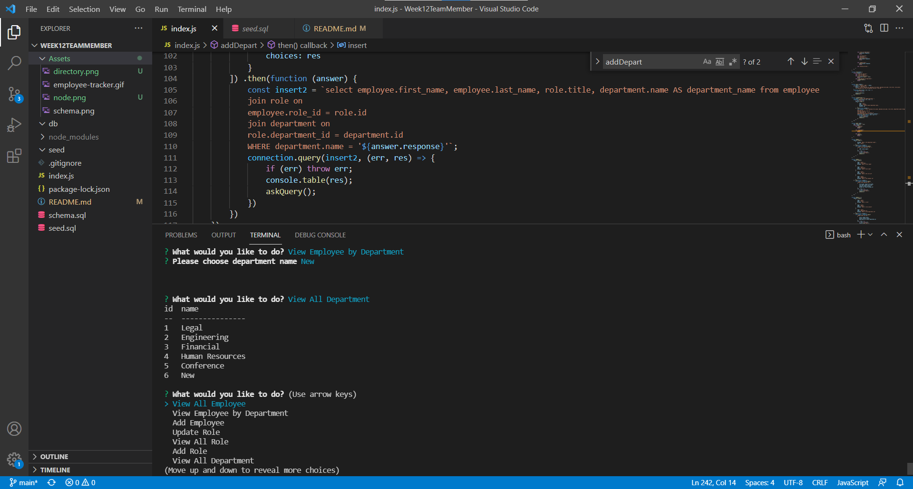

# Employee Tracker

## Table of Content
[1 - Description](##Description) [2 - Installation Instructions](##Installation-Instructions) [3 - Usage](##Usage) [4 - Contribution](##Contribution) [5 - Test](##Test) [6 - License](##License) [7 - Questions](##Questions) 

## Description
Tracks employees through MySQL.  Has employee list, departments, and roles.  Able to add employees, roles, and departments.  Able to edit roles.  

## Installation Instructions
After cloning from github, open up folder in VSC.  Run npm i to get started.  Run mysql -uroot -p < schema.sql and mysql -uroot -p < seed.sql.  Run node index.js to begin inquirer prompt.

 

## Usage
Once node index.js begins, answer questions as necessary to track employees and their departments and roles.
[Video](https://drive.google.com/file/d/1yzaDlRQVAUzuCXnx5iX49J3pLWI6wZt7/view)

 

## Contribution
None

## Test
None

## License

None

## Questions
If you have additional questions you can reach me on Github: [desantel](https://github.com/desantel)
